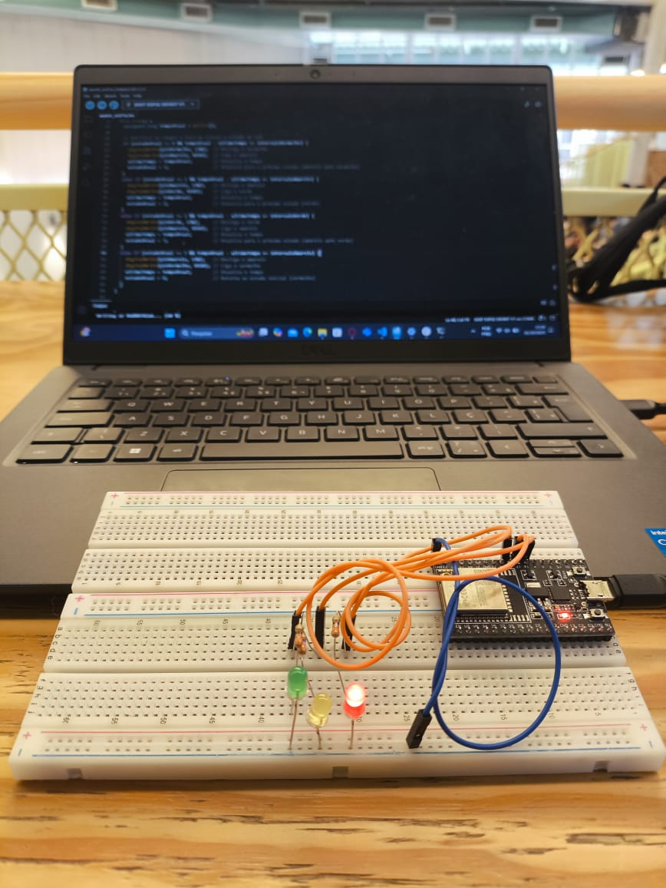

# Montagem

A montagem começou com a inserção do ESP32 na protoboard e a separação dos LEDs nas cores correspondentes ao semáforo. Em seguida, selecionei três jumpers, observando as normas de cores: laranja para o pino de 3,3V, conectando-os aos pinos 16, 17 e 5 do ESP32. Por fim, conectei o jumper preto ao pino GND, garantindo o fechamento do circuito.


# Código

``` c++
const int vermelho = 16;
const int amarelo = 17;
const int verde = 5;

 unsigned long intervaloVermelho = 6000; 
const unsigned long intervaloAmarelo = 2000;  
const unsigned long intervaloVerde = 2000;    

unsigned long ultimoTempo = 0; // Tempo da útlima troca
int estadoAtual = 0;           // 0 = vermelho, 1 = amarelo (após vermelho), 2 = verde, 3 = amarelo (após verde)

void setup() {
  pinMode(vermelho, OUTPUT);
  pinMode(amarelo, OUTPUT);
  pinMode(verde, OUTPUT);
}

void loop() {
  unsigned long tempoAtual = millis();

  // Verifica se chegou a hora de trocar o estado do LED
  if (estadoAtual == 0 && tempoAtual - ultimoTempo >= intervaloVermelho) {
    digitalWrite(vermelho, LOW);  // Desliga o vermelho
    digitalWrite(amarelo, HIGH);  // Liga o amarelo
    ultimoTempo = tempoAtual;        // Atualiza o tempo
    estadoAtual = 1;                 // Atualiza para o próximo estado (amarelo após vermelho)
  }
  else if (estadoAtual == 1 && tempoAtual - ultimoTempo >= intervaloAmarelo) {
    digitalWrite(amarelo, LOW);   // Desliga o amarelo
    digitalWrite(verde, HIGH);    // Liga o verde
    ultimoTempo = tempoAtual;        // Atualiza o tempo
    estadoAtual = 2;                 // Atualiza para o próximo estado (verde)
  }
  else if (estadoAtual == 2 && tempoAtual - ultimoTempo >= intervaloVerde) {
    digitalWrite(verde, LOW);     // Desliga o verde
    digitalWrite(amarelo, HIGH);  // Liga o amarelo
    ultimoTempo = tempoAtual;        // Atualiza o tempo
    estadoAtual = 3;                 // Atualiza para o próximo estado (amarelo após verde)
  }
  else if (estadoAtual == 3 && tempoAtual - ultimoTempo >= intervaloAmarelo) {
    digitalWrite(amarelo, LOW);   // Desliga o amarelo
    digitalWrite(vermelho, HIGH); // Liga o vermelho
    ultimoTempo = tempoAtual;        // Atualiza o tempo
    estadoAtual = 0;                 // Retorna ao estado inicial (vermelho)
  }
}

```


Segue agora a foto do sistema montado


<div align="center">
<sub>Foto</sub><br>
<br>
</div>

<div align="center">
  <sub>Vídeo</sub><br>
  <video width="70%" controls>
    <source src="assets/video.mp4" type="video/mp4">
  </video>
</div>

Também acesso do vídeo por esse link do drive [link](https://drive.google.com/file/d/1cflEglEFli_yQNusDtMd-NhzFPlvKF9j/view?usp=sharing)


# Lista de materiais 

| Componente          | Quantidade | Descrição                                         |
|---------------------|------------|---------------------------------------------------|
| Protoboard          | 1          | Base para montagem dos circuitos                  |
| ESP32 WROOM-32U     | 1          | Microcontrolador utilizado para controlar os LEDs |
| LED Vermelho        | 1          | Indicador de estado                               |
| LED Amarelo         | 1          | Indicador de estado                               |
| LED Verde           | 1          | Indicador de estado                               |
| Resistores (330Ω)   | 3          | Limitadores de corrente para cada LED             |
| Jumpers (Fios)      | 5          | Conectores para ligar os componentes              |
| Cabo USB            | 1          | Conexão entre o ESP32 e o computador              |


#### Avaliador: Raphael Silva

|Critério|	Contempla (Pontos)|	Contempla Parcialmente (Pontos)	|Não Contempla (Pontos)	|Observações do Avaliador|
|-|-|-|-|-|
|Montagem física com cores corretas, boa disposição dos fios e uso adequado de resistores	|Até 3	|Até 1,5	|0 | Contempla|	
|Temporização adequada conforme tempos medidos com auxílio de algum instrumento externo	|Até 3	|Até 1,5	|0 |Contempla |	
|Código implementa corretamente as fases do semáforo e estrutura do código (variáveis representativas e comentários) |	Até 3|	Até 1,5 |	0 | Contempla |	
|Ir além: Implementou um componente de extra, fez com millis() ao invés do delay() e/ou usou ponteiros no código |	Até 1 |	Até 0,5 |	0 |Contempla |	
| | | | |Pontuação Total = 10|